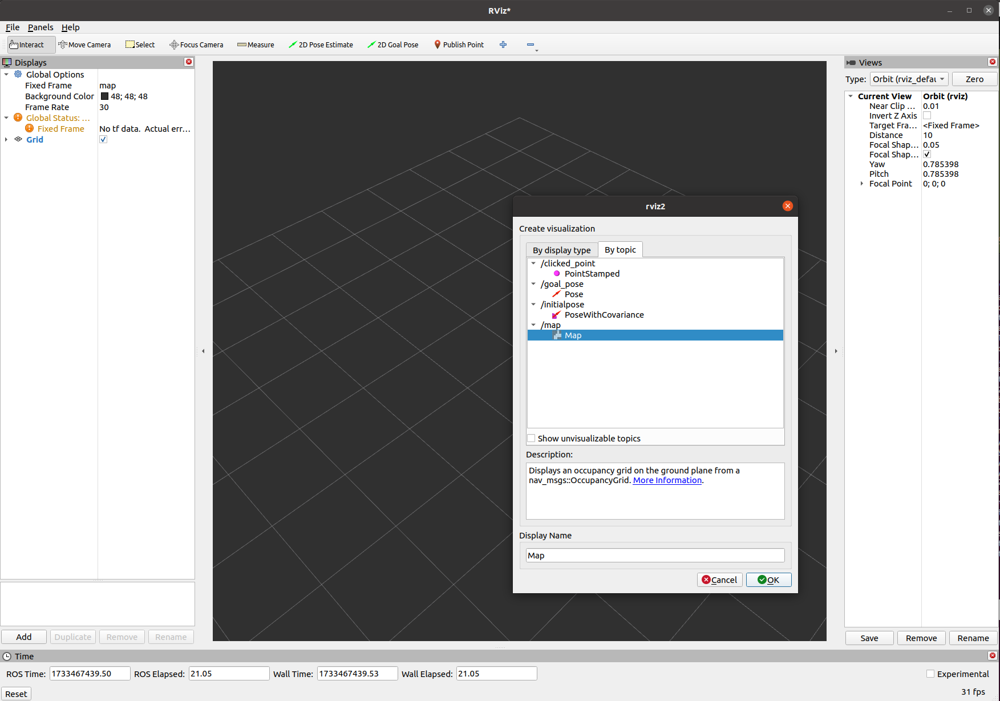
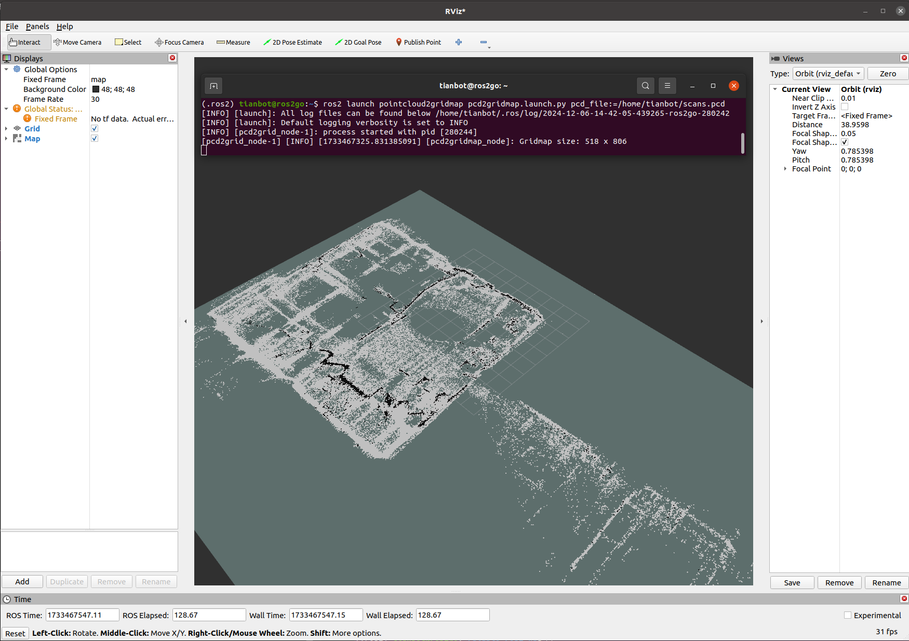
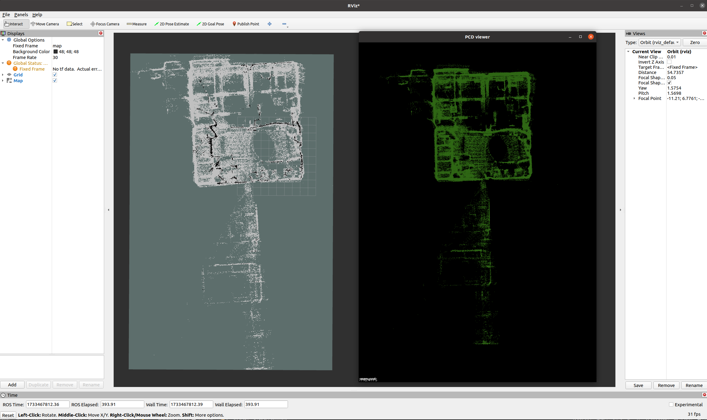

# pointcloud2gridmap

A integrated tools for pointclound to Occupancy Grid map with pcl and ros2

## Usage

### 1. Install

```bash
sudo apt-get install libpcl-dev
sudo apt-get install pcl-tools
sudo apt-get install ros-$(ROS_DISTRO)-pcl-ros
sudo apt-get install ros-$(ROS_DISTRO)-grid-map
```

### 2. Build

```bash
mkdir -p ~/ros2_ws/src && git clone https://github.com/Robotic-Developer-Road/pointcloud2gridmap.git
colcon build --packages-select pointcloud2gridmap --symlink-install
```

### 3. Run

```bash
ros2 launch pointcloud2gridmap pcd2gridmap.launch.py pcd_file:=/home/tianbot/scans.pcd
```

### 4. View

- launch `rviz2`

```bash
rviz2
```




- add `map` topic


```bash
pcl_viewer scans.pcd
```

